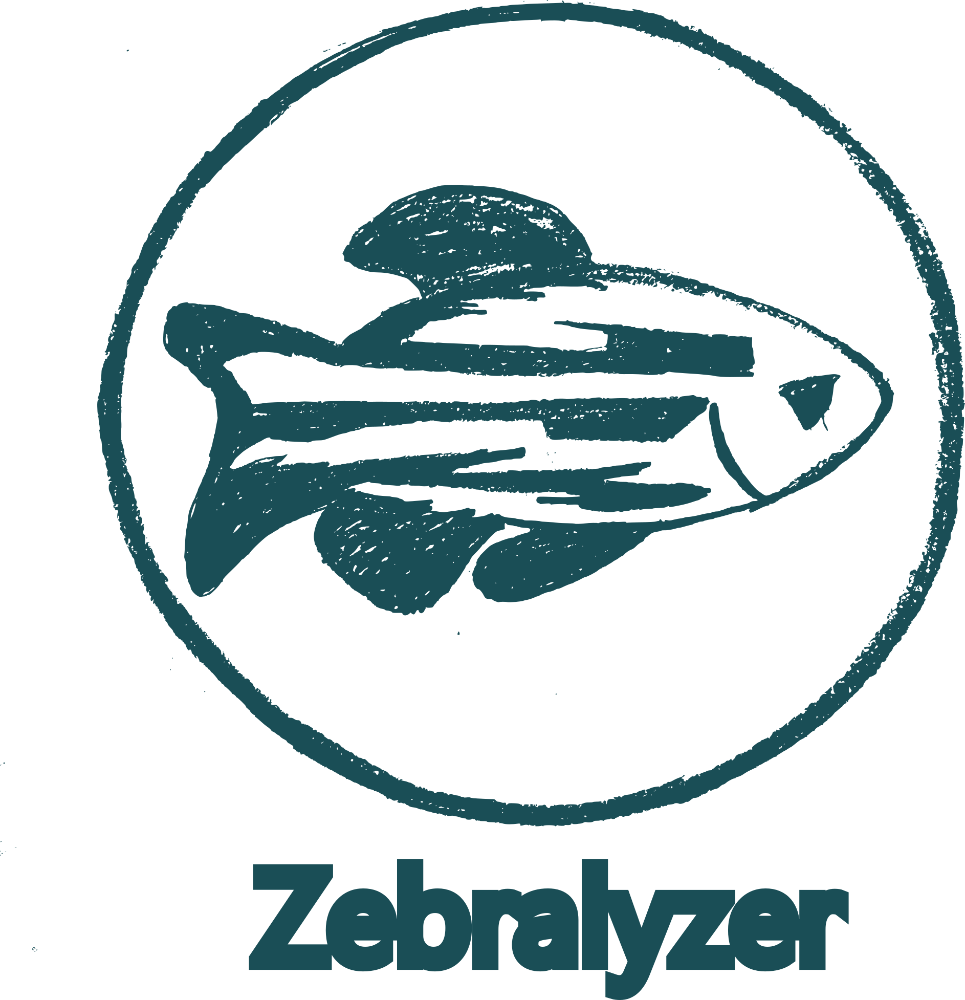
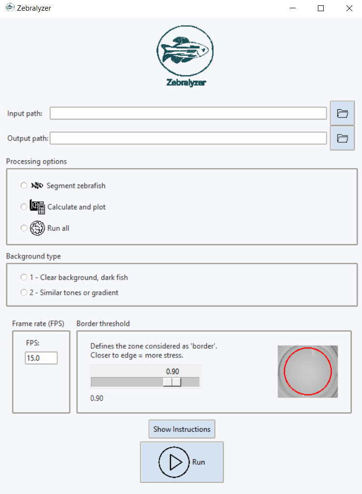

# ZEBRALYZER

  

**Zebralyzer** is a Python-based tool designed to analyze the behavior of zebrafish embryos.

The application allows for segmentation of fish in videos/images, detection of head and tail, and calculation of key kinematic variables such as displacement, velocity, acceleration, global orientation, and time spent outside the center.

---

## USER INTERFACE
Below is a preview of the Zebralyzer graphical interface:

  

---

## HOW TO USE THE APPLICATION
1. Download the executable file (.exe): [Zebralyzer.exe](https://github.com/carlaherreroserra/Zebralyzer/releases/latest)
2. Run the file.
3. Select the input and output folders, choose the analysis mode, adjust the parameters according to the needs of the experiment, and click "Run".  
   All details are explained in the instructions section of the application.

---

## GENERATED OUTPUTS
Zebralyzer automatically generates the following results:
### For each file:
- `.tiff` file with the segmented animal.
- `.tiff` file with head and tail annotations.
- `.txt` file with head and tail coordinates.
- `.tiff` file with aligned masks of the fish.
- `.csv` file with the main metrics.
- `.pdf` file with individual graphs.
- `.csv` file summarizing key values.

### From a set of processed files:
- `.csv` file with the main metrics of each processed file.
- `.pdf` file with comparative graphs for each calculated variable.

---
  
## PROJECT FILES
- `gui.py`: Graphical user interface using Tkinter.
- `pez.py`: Fish segmentation and head/tail detection.
- `calculos.py`: Kinematic calculations based on coordinates.
- `Zebralyzer.spec`: PyInstaller configuration to generate the `.exe`.
- `assets/`: Visual resources.

---

## AUTHOR
**Carla Herrero Serra**
Final Degree Project – Biomedical Engineering
   
